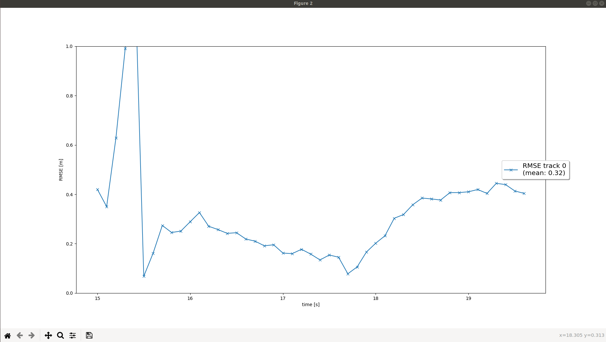
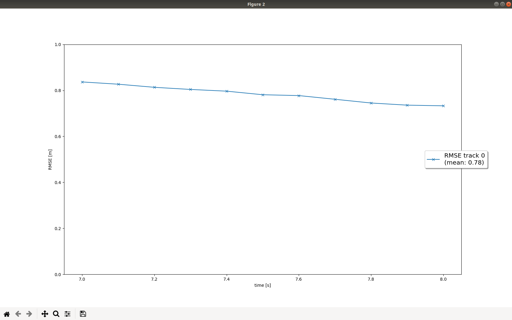
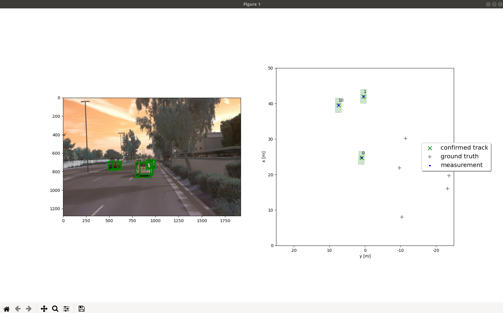
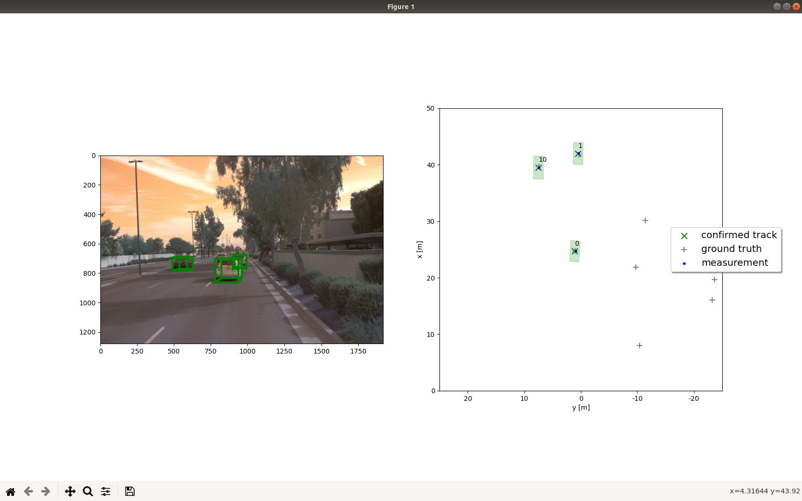
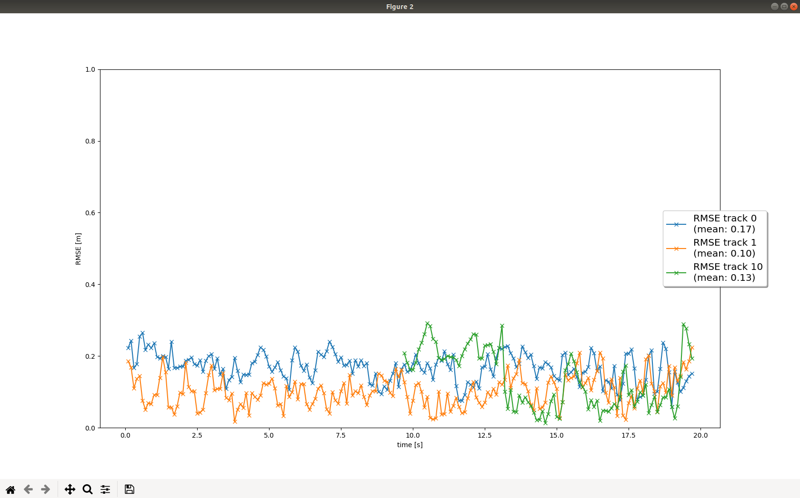

# Writeup: Track 3D-Objects Over Time

In this section, I learned how to process  Kalman Filter, sensor fusion and tracking mothods.

## Step 1. Implementing an Extended Kalman Filter

Two steps:
  - `Predict`: Predict state x and estimation error covariance P
  - `Update`: Update state x and covariance P

RMSE of lidar tracking:

## Step 2. Implementimg a Track Management

Implementing the track management to initialize and delete tracks, set a track state and a strack score.

The following steps were taken for this:

- `State Initialization`: stat x, covariance P
- Initialize new track with unassigned lidar measurement
- `Track score`:
    If the scores on the track are correlated with measurement, then the corresponding scores will be increased and vice versa
- `Track state`: Based on the track score, a track state can be defined, for example `initialized`, `tentative` or `confirmed`.
- `Track delete`:
    if score is smaller than threshold or P is too big, then remove this track.

The following image shows the rmse plot for single tracking.

## Step 3. Data Association

Implementing a single nearest neighbor data association to associate measurements to tracks.

- Initialize association matrix
- `Mahalanobis Distance`: We calculate the distance of Mahalanobis Distance between all tracks and measurements.

- `Gating`: check if a measurement lies inside a tracks gate.

    If a measurement lies outside a track's gate, we can set the distance to infinity

- Update association matrix:

    We choose the pair with the smallest Mahalanobis Distance, update Kalman Filter, and delete the relation matrix with the appropriate row and column.

## Step 4. Sensor Fusion

Implementing camera-lidar fusion.

- `Visibility`: check if the object can be seen by this sensor
- `EKF`: extend Kalman Filter to support the non-linear transformation of the camera measurement.
  - nonlinear camera measurement function h:
    - transform position estimate from vehicle to camera coordinates
    - project from camera to image coordinates
  - calculate Jacobian H

Final reslut:

## Difficulties Faced in Project

All codes we needs are almost be mentioned in the class.
But in `trackmengement` part, I have some confuse, as below:

- decress score for unassigned tracka:

    This part was not mentioned in the class, so I spent some time studying and understanding this part.

- track deletion criteria:

    In the class material, it said when covariance was smaller than some threshold then this track would be deleted, but the "Hints" said the track would be deleted when covariance P is too big. So I spent some time studying and understanding this part.

## Benefits in Camera-Lidar Fusion

By combining the high-resolution position information characteristic of lidar with the camera's ability to classify and its pixel position of objects, we can gain more accurate results about the position and the size of a 3D bounding box.

Comparing the RSME results, we can find the rmse of camera-lidar fusion is lower than the rmse of only lidar measurement, as below:

Only Lidar measurement:

Camera-Lidar Fusion:

## Challenges in real-life scenarios

- Coordinate Transformation: Each sensor has its own coordinates

- Time synchronization:

    We need to do sensor fusion on each timestep, guarantee data of each sensor of frame are correct and can do sensor fusion without error.

- More complex environment

## Ways to Improve Tracking Results

- Fine-tune the parameters in `param.py`, such as process noise Q, measurement noise R, initial setting for estimation error covariance P.
- Other data association method, such as `Global Nearest Neighbor (GNN)` or `Probabilistic Data Association (PDA)`.
